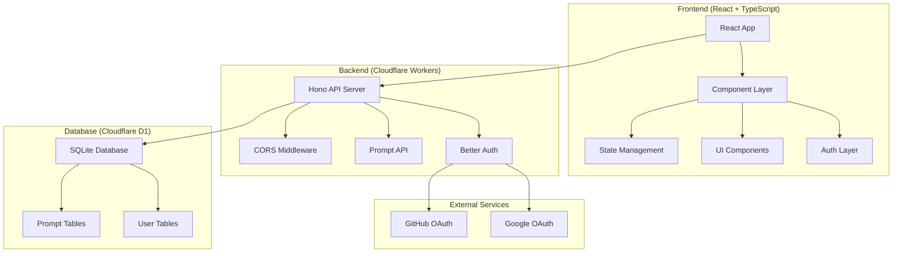

# Design Document

## Overview

The XML Prompt Builder is a full-stack web application designed to provide a visual interface for creating, editing, and managing structured XML prompts for AI systems. The application follows a modern web architecture with a React TypeScript frontend, Cloudflare Workers backend, and SQLite database hosted on Cloudflare D1.

### Key Features
- Visual XML element creation and editing with drag-and-drop interface
- Real-time XML preview with syntax highlighting and token counting
- User authentication via OAuth (Google, GitHub) using Better Auth
- Persistent prompt storage with user-scoped access
- Import/export functionality for XML files
- Responsive design with dark mode support

## Architecture

### High-Level Architecture



### Technology Stack

**Frontend:**
- React 18.3.1 with TypeScript
- Vite 5.4.1 for build tooling
- Tailwind CSS 3.4.11 for styling
- Radix UI components for accessible UI primitives
- TanStack React Query 5.56.2 for server state management
- React Router DOM 6.26.2 for client-side routing
- Better Auth React client for authentication

**Backend:**
- Hono 4.9.1 web framework on Cloudflare Workers
- Better Auth 1.3.6 for authentication with OAuth providers
- Drizzle ORM 0.44.4 for database operations
- Cloudflare D1 (SQLite) for data persistence

**Development & Deployment:**
- Wrangler 4.15.2 for Cloudflare Workers deployment
- ESLint for code linting
- TypeScript for type safety

## Components and Interfaces

### Frontend Component Architecture

#### Core Components

**PromptBuilder** (`src/components/PromptBuilder.tsx`)
- Main component orchestrating the XML building interface
- Manages XMLElement state and operations
- Handles import/export functionality
- Provides real-time XML generation and token counting

```typescript
interface XMLElement {
  id: string;
  tagName: string;
  content: string;
  children: XMLElement[];
  collapsed?: boolean;
  isVisible?: boolean;
}

interface PromptBuilderRef {
  clearAll: () => void;
  hasContent: () => boolean;
  getCurrentXML: () => string;
  importFromText: (text: string) => void;
}
```

**ElementTree** (`src/components/ElementTree.tsx`)
- Renders hierarchical tree view of XML elements
- Handles element selection, reordering, and visibility toggling
- Provides context actions (add child, delete, move up/down)

**ElementEditor** (`src/components/ElementEditor.tsx`)
- Form interface for editing selected XML element properties
- Real-time updates to element tagName and content

#### Page Components

**Index** (`src/pages/Index.tsx`)
- Main application page with PromptBuilder integration
- Handles prompt loading, saving, and management for authenticated users
- Provides landing page content for unauthenticated users

**Dashboard** (`src/pages/Dashboard.tsx`)
- User prompt library with grid view of saved prompts
- Prompt preview, deletion, and navigation to editor

**Authentication Pages**
- `Login.tsx`: OAuth provider selection
- `AuthLogin.tsx`: OAuth callback handling
- `Account.tsx`: User account management

#### Authentication System

**Better Auth Integration**
- Client-side auth state management via `useBetterAuth` hook
- Authenticated fetch wrapper for API calls
- Local storage caching for user session persistence
- OAuth flow handling with Google and GitHub providers

### Backend API Architecture

#### API Endpoints

**Authentication Routes** (`/api/auth/*`)
- Handled by Better Auth middleware
- OAuth provider callbacks and session management
- Session validation and user profile endpoints

**Prompt Management Routes**
- `GET /api/prompts` - List user's prompts with pagination
- `POST /api/prompts` - Create new prompt
- `GET /api/prompts/:id` - Fetch specific prompt
- `PATCH /api/prompts/:id` - Update prompt name/content
- `DELETE /api/prompts/:id` - Delete prompt

#### Middleware Stack

1. **CORS Middleware** - Configures cross-origin requests
2. **Auth Initialization** - Sets up Better Auth instance
3. **Route Protection** - Validates sessions for protected endpoints

## Data Models

### Database Schema

#### User Management (Better Auth)

```sql
-- Users table
CREATE TABLE user (
  id TEXT PRIMARY KEY,
  name TEXT NOT NULL,
  email TEXT NOT NULL UNIQUE,
  emailVerified BOOLEAN NOT NULL DEFAULT 0,
  image TEXT,
  createdAt DATETIME DEFAULT CURRENT_TIMESTAMP,
  updatedAt DATETIME DEFAULT CURRENT_TIMESTAMP
);

-- Sessions table
CREATE TABLE session (
  id TEXT PRIMARY KEY,
  userId TEXT NOT NULL,
  token TEXT NOT NULL UNIQUE,
  expiresAt DATETIME NOT NULL,
  ipAddress TEXT,
  userAgent TEXT,
  createdAt DATETIME DEFAULT CURRENT_TIMESTAMP,
  updatedAt DATETIME DEFAULT CURRENT_TIMESTAMP,
  FOREIGN KEY (userId) REFERENCES user(id) ON DELETE CASCADE
);

-- OAuth accounts table
CREATE TABLE account (
  id TEXT PRIMARY KEY,
  userId TEXT NOT NULL,
  accountId TEXT NOT NULL,
  providerId TEXT NOT NULL,
  accessToken TEXT,
  refreshToken TEXT,
  scope TEXT,
  createdAt DATETIME DEFAULT CURRENT_TIMESTAMP,
  updatedAt DATETIME DEFAULT CURRENT_TIMESTAMP,
  FOREIGN KEY (userId) REFERENCES user(id) ON DELETE CASCADE
);
```

#### Application Data

```sql
-- Prompts table
CREATE TABLE prompts (
  id TEXT PRIMARY KEY,
  user_id TEXT NOT NULL,
  name TEXT NOT NULL,
  content TEXT NOT NULL,
  created_at TIMESTAMP DEFAULT CURRENT_TIMESTAMP,
  updated_at TIMESTAMP DEFAULT CURRENT_TIMESTAMP
);
```

### Data Flow Patterns

#### XML Element Management
1. User creates/modifies elements in PromptBuilder
2. State updates trigger XML regeneration
3. Generated XML is displayed in preview pane
4. Local storage persists work-in-progress

#### Prompt Persistence
1. User saves prompt with name
2. Frontend sends authenticated request to backend
3. Backend validates session and stores prompt with user association
4. Frontend updates local prompt list

#### Authentication Flow
1. User initiates OAuth login
2. Better Auth handles provider redirect
3. Backend creates/updates user session
4. Frontend receives session data and updates auth state
5. Subsequent API calls include session credentials

## Error Handling

### Frontend Error Handling

**Component Error Boundaries**
- `AuthErrorFallback.tsx` handles authentication-related errors
- Toast notifications for user feedback via Sonner library
- Graceful degradation for network failures

**API Error Handling**
- Authenticated fetch wrapper handles token refresh
- Retry logic for transient failures
- User-friendly error messages for common scenarios

### Backend Error Handling

**Request Validation**
- Input sanitization and type checking
- Proper HTTP status codes for different error types
- Structured error responses with consistent format

**Database Error Handling**
- Transaction rollback for data consistency
- Graceful handling of constraint violations
- Connection pooling and retry mechanisms

## Testing Strategy

### Frontend Testing
- Component unit tests for core functionality
- Integration tests for authentication flows
- End-to-end tests for critical user journeys
- Visual regression testing for UI components

### Backend Testing
- API endpoint testing with various input scenarios
- Authentication middleware testing
- Database operation testing with mock data
- Performance testing for concurrent users

### Testing Tools
- Jest for unit testing
- React Testing Library for component testing
- Playwright for end-to-end testing
- Wrangler for local development testing

## Performance Optimizations

### Frontend Optimizations
- Code splitting with React.lazy for route-based chunks
- Memoization of expensive computations (XML generation)
- Virtual scrolling for large prompt lists
- Debounced input handling for real-time updates

### Backend Optimizations
- Database indexing on frequently queried columns
- Pagination for large result sets
- Efficient SQL queries with proper joins
- Cloudflare Workers edge computing for low latency

### Caching Strategy
- Browser caching for static assets
- Local storage for user preferences and draft work
- Session caching to reduce authentication overhead
- CDN caching for public assets

## Security Considerations

### Authentication Security
- OAuth 2.0 with PKCE for secure authorization
- Secure session management with httpOnly cookies
- CSRF protection via Better Auth
- Session expiration and refresh token rotation

### API Security
- CORS configuration restricting allowed origins
- Input validation and sanitization
- Rate limiting to prevent abuse
- User-scoped data access controls

### Data Protection
- Encrypted data transmission via HTTPS
- Secure environment variable management
- Database access controls and user isolation
- Regular security dependency updates

## Deployment Architecture

### Development Environment
- Frontend: Vite dev server on localhost:8080
- Backend: Wrangler dev server on localhost:8787
- Database: Local D1 SQLite instance
- Proxy configuration for API requests

### Production Environment
- Frontend: Deployed to Vercel with custom domain
- Backend: Cloudflare Workers with custom domain
- Database: Cloudflare D1 production instance
- CDN: Cloudflare for global content delivery

### Environment Configuration
- Separate environment variables for dev/prod
- OAuth provider configurations per environment
- Database connection strings and credentials
- CORS origins and trusted domains

### Monitoring and Observability
- Cloudflare Workers analytics and logs
- Error tracking and alerting
- Performance monitoring and metrics
- User analytics and usage patterns