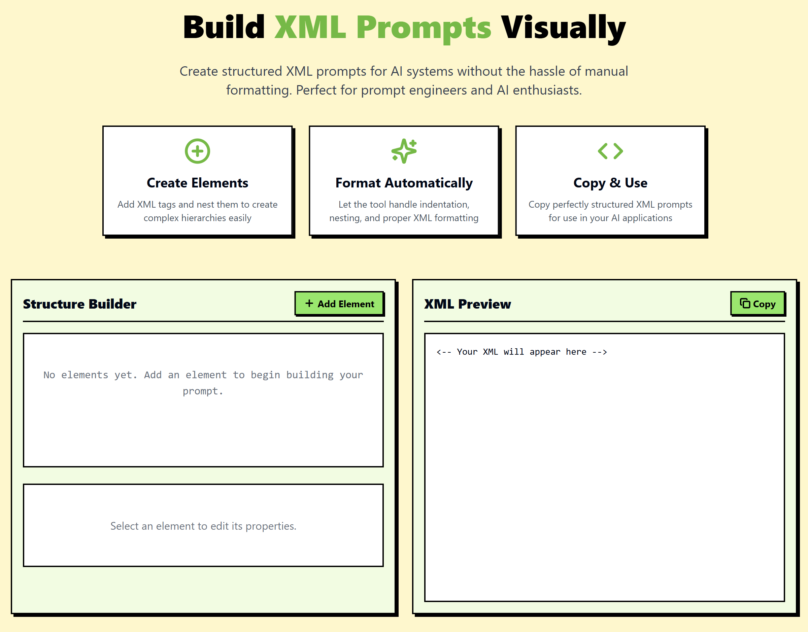

# XML Prompt Builder

<div align="center">

[](https://deepwiki.com/lolrazh/xml-prompt-builder)


</div>

<div align="center">
  
</div>

## 🚀 Overview

XML Prompt Builder is a visual tool for creating structured XML prompts for AI systems. This project helps prompt engineers and AI enthusiasts to create, edit, and format complex XML structures without dealing with manual syntax and formatting issues.

## ✨ Features

- **Visual XML Building**: Create structured XML elements through an intuitive interface
- **Nested Structures**: Easily create parent-child relationships with proper nesting
- **Real-time Preview**: See your XML structure update in real-time as you build
- **Drag & Drop Reordering**: Rearrange elements with simple up/down controls
- **Collapsible Elements**: Toggle visibility of complex nested structures
- **Copy to Clipboard**: Export your finished XML with one click

## 🛠️ How to Use

### Getting Started
1. Click "Add Element" to create a new XML tag
2. Select any element to edit its name and content
3. Add child elements to create nested structures

### Managing Elements
- Toggle elements to collapse/expand them
- Use the up/down arrows to rearrange elements
- Child elements will stay within their parent when rearranged

### Preview & Export
- Preview your XML on the right panel
- Copy the final XML with the copy button when you're done

## 🔧 Technical Implementation

XML Prompt Builder is built using:

- React + TypeScript for a robust component architecture
- Vite for lightning-fast development experience
- Tailwind CSS for responsive and customizable styling
- shadcn/ui for beautiful UI components
- Lucide React for crisp, scalable icons

## 🏁 Running Locally

```sh
# Clone the repository
git clone https://github.com/lolrazh/xml-prompt-builder.git

# Navigate to project directory
cd xml-prompt-builder

# Install dependencies
npm install

# Start development server
npm run dev
```

## 🧩 Use Cases

- Creating structured prompts for large language models
- Designing XML-based templates for API requests
- Generating configuration files with proper formatting
- Teaching XML structure and syntax to beginners

## 🤝 Contributing

Contributions are welcome! Feel free to submit pull requests or open issues for new features, bug fixes, or improvements.

1. Fork the repository
2. Create your feature branch (`git checkout -b feature/amazing-feature`)
3. Commit your changes (`git commit -m 'Add some amazing feature'`)
4. Push to the branch (`git push origin feature/amazing-feature`)
5. Open a Pull Request

## 📝 License

This project is licensed under the MIT License - see the LICENSE file for details.

## 🙏 Acknowledgments

- Built with ♥ for prompt engineers and AI enthusiasts
- Find me on GitHub [@lolrazh](https://github.com/lolrazh)
